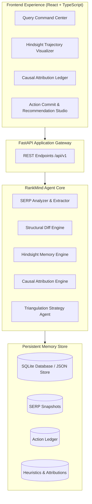

# RankMind: Technical Architecture & System Design
## Version 1.0 — Empirical SEO & Search Intelligence Agent

---

### 1. High-Level Architecture Overview

RankMind consists of three tightly coupled layers:
1. **Intelligence & Ingestion Engine**: Collects, parses, and normalizes SERP rankings and page-level feature signals.
2. **Hindsight Memory & Attribution Core**: The central differentiator. Houses the time-series snapshots, diff analysis engine, optimization action ledger, and causal attribution engine.
3. **Synthesis & Strategy Agent**: Evaluates current observations against historical memory to deliver actionable intelligence with clear distinction between facts, memory, outcomes, and recommendations.
4. **Professional Web Console**: Modern, high-performance UI tailored for growth leads to visualize timelines, competitor shifts, attribution logs, and register optimization experiments.



---

### 2. Data Models & Schemas

#### **A. SERP Snapshot (`SERPSnapshot`)**
Captures a point-in-time state of the search engine results page for a specific keyword.
```python
class SERPItem(BaseModel):
    rank: int                          # 1, 2, 3...
    url: str
    domain: str
    title: str
    snippet: str
    word_count: int
    has_interactive_widget: bool       # e.g., code runner, quiz, calculator
    has_video_preview: bool
    has_curriculum_table: bool
    schema_types: List[str]            # Course, FAQPage, Article, etc.
    last_updated: Optional[str]
    readability_score: float           # e.g., 0-100
    citation_density: float            # citations / reference links per 1k words
    target_match_score: float          # query intent match (0-100)

class SERPSnapshot(BaseModel):
    id: str                            # snapshot UUID
    query: str                         # e.g. "best python courses for beginners"
    timestamp: str                     # ISO 8601
    cycle_index: int                   # 0 = initial, 1 = T+30d, 2 = T+60d, etc.
    total_results_evaluated: int
    items: List[SERPItem]
```

#### **B. Optimization Action (`OptimizationAction`)**
Records an exact optimization action implemented by the team on a specific date.
```python
class ActionCategory(str, Enum):
    CONTENT_DEPTH = "content_depth"
    INTERACTIVE_UX = "interactive_ux"
    SCHEMA_MARKUP = "schema_markup"
    ONPAGE_STRUCTURE = "onpage_structure"
    FRESHNESS_UPDATE = "freshness_update"
    CERTIFICATION_CREDIBILITY = "certification_credibility"

class OptimizationAction(BaseModel):
    id: str                            # action UUID
    query: str
    target_domain: str
    target_url: str
    timestamp: str                     # Date when action was applied
    category: ActionCategory
    title: str                         # Short descriptive summary
    description: str                   # Detailed description of changes made
    hypothesis: str                    # Expected ranking impact / reason
    snapshot_before_id: str            # Snapshot ID capturing pre-action rank
```

#### **C. Competitor Diff Record (`CompetitorDiff`)**
Tracks what competitor domains changed between consecutive snapshots.
```python
class CompetitorDiff(BaseModel):
    id: str
    query: str
    domain: str
    cycle_from: int
    cycle_to: int
    rank_delta: int                    # e.g., +2 or -1
    changes_detected: List[str]        # e.g., "Added interactive code sandbox", "Expanded syllabus table"
    feature_shifts: Dict[str, Any]     # changes in boolean flags / word count deltas
```

#### **D. Causal Attribution & Learned Memory Node (`MemoryNode`)**
The empirical lesson learned by connecting an optimization action to an observed outcome.
```python
class AttributionVerdict(str, Enum):
    CONFIRMED_POSITIVE = "confirmed_positive"   # Rank increased, strong attribution
    NEUTRAL = "neutral"                         # No meaningful change
    CONFIRMED_NEGATIVE = "confirmed_negative"   # Rank decreased after action
    CONFOUNDED = "confounded"                   # Competitor surge or algorithm shift obscured impact

class MemoryNode(BaseModel):
    id: str
    query: str
    target_domain: str
    action_id: str
    action_category: ActionCategory
    action_title: str
    date_applied: str
    date_evaluated: str
    latency_days: int
    rank_before: int
    rank_after: int
    rank_delta: int                            # e.g., +3 positions (e.g. #7 to #4 is +3)
    verdict: AttributionVerdict
    confidence_score: float                    # 0.0 to 1.0 based on confounding factors
    agent_distilled_lesson: str                # Non-generic historical takeaway
```

#### **E. Intelligence Audit Synthesis Response (`AuditReport`)**
The multi-tier intelligence deliverable presented to the user.
```python
class AuditReport(BaseModel):
    query: str
    target_domain: str
    current_snapshot: SERPSnapshot
    current_rank: Optional[int]
    historical_peak_rank: Optional[int]
    
    # 4 Required Perspectives:
    current_observations: List[str]            # Live facts about leaders vs target
    historical_memory: List[MemoryNode]        # Timeline of what was tried & what happened
    observed_outcomes_summary: str             # High-level narrative of historical causality
    prescriptive_recommendations: List[Dict[str, Any]] # Prioritized recommendations with evidence tier:
                                               # [Historically Proven], [Competitor Trend], [Hypothesis]
```

---

### 3. The Hindsight Memory & Attribution Algorithm

How RankMind assesses causality without naive assumptions:

1. **Baseline Measurement**: Identify Target Rank $R(T_{pre})$ at baseline snapshot.
2. **Action Window Tracking**: Log action $A$ at $T_{action}$. Allow latency window $\Delta t$ (e.g., 14–30 days) for search engines to index and re-weight.
3. **Post-Evaluation**: Measure Target Rank $R(T_{post})$. Calculate raw delta:
   $$\Delta R = R(T_{pre}) - R(T_{post})$$
   *(Note: Moving from #7 to #4 is $\Delta R = +3$)*
4. **Confounder Matrix Evaluation**:
   - Check competitor shifts in the same SERP: Did #1-#3 also change? Did a new competitor jump ahead?
   - If competitors remained static and $\Delta R > 0$, **Confidence is HIGH**.
   - If a competitor made a massive structural update simultaneously, **Verdict is CONFOUNDED** or **COMPETITOR_SURGE**.
5. **Memory Fortification**:
   - The distilled rule is tagged to the `query` and `action_category`.
   - In subsequent recommendation rounds, tactics that yielded positive deltas in this query are given priority weights.

---

### 4. Project Directory Layout

```
RankMind/
├── docs/
│   ├── PRODUCT_SPEC.md              # Complete product specification & vision
│   └── ARCHITECTURE.md              # Technical design & schema specifications
├── backend/
│   ├── app/
│   │   ├── __init__.py
│   │   ├── main.py                  # FastAPI application entrypoint
│   │   ├── core/
│   │   │   ├── config.py            # Application settings
│   │   │   └── database.py          # SQLite persistence & initialization
│   │   ├── models/
│   │   │   └── schemas.py           # Pydantic models for SERP, Memory, Actions
│   │   ├── services/
│   │   │   ├── serp_collector.py    # SERP simulation & real data extractor
│   │   │   ├── hindsight_store.py   # Memory store for snapshots, actions & heuristics
│   │   │   ├── diff_engine.py       # Snapshot comparison & competitor delta engine
│   │   │   ├── attribution_engine.py# Outcome attribution & confidence calculator
│   │   │   └── strategy_agent.py    # Multi-tier reasoning & empirical recommendations
│   │   └── seed/
│   │       └── scenarios.py         # Realistic seed dataset for "best python courses for beginners"
│   ├── requirements.txt
│   └── run.py
├── frontend/
│   ├── index.html
│   ├── package.json
│   ├── tsconfig.json
│   ├── vite.config.ts
│   └── src/
│       ├── main.tsx
│       ├── App.tsx
│       ├── index.css                # Polished design system tokens (dark mode, glassmorphism)
│       ├── types/
│       │   └── index.ts             # TypeScript definitions aligned with backend schemas
│       ├── services/
│       │   └── api.ts               # API client
│       └── components/
│           ├── Header.tsx           # Query bar, active target domain selector, status
│           ├── SerpLeaderboard.tsx  # Top 10 matrix with feature comparison
│           ├── HindsightTimeline.tsx# Interactive historical rank trajectory with event pins
│           ├── AttributionLedger.tsx# What Worked vs What Failed historical ledger
│           ├── RecommendationsPanel.tsx # 4-Perspective intelligence breakdown
│           └── ActionLoggerModal.tsx# Form to log new optimization experiments
└── README.md
```

---

### 5. API Specification

| Method | Endpoint | Description |
|---|---|---|
| `GET` | `/api/v1/health` | Healthcheck and active memory status |
| `GET` | `/api/v1/queries` | List available tracked search queries |
| `GET` | `/api/v1/audit/{query}` | Get complete audit report (Current observations, memory, recommendations, outcomes) |
| `GET` | `/api/v1/snapshots/{query}` | Get historical timeline snapshots for the query |
| `GET` | `/api/v1/attributions/{query}` | Get memory ledger of past actions and their causal outcomes |
| `POST` | `/api/v1/actions` | Log a new optimization action into the Hindsight ledger |
| `POST` | `/api/v1/evaluate-cycle` | Advance evaluation cycle to test new rank outcomes against logged actions |
| `POST` | `/api/v1/reset-demo` | Reset state to clean seed scenario for demonstrations |
