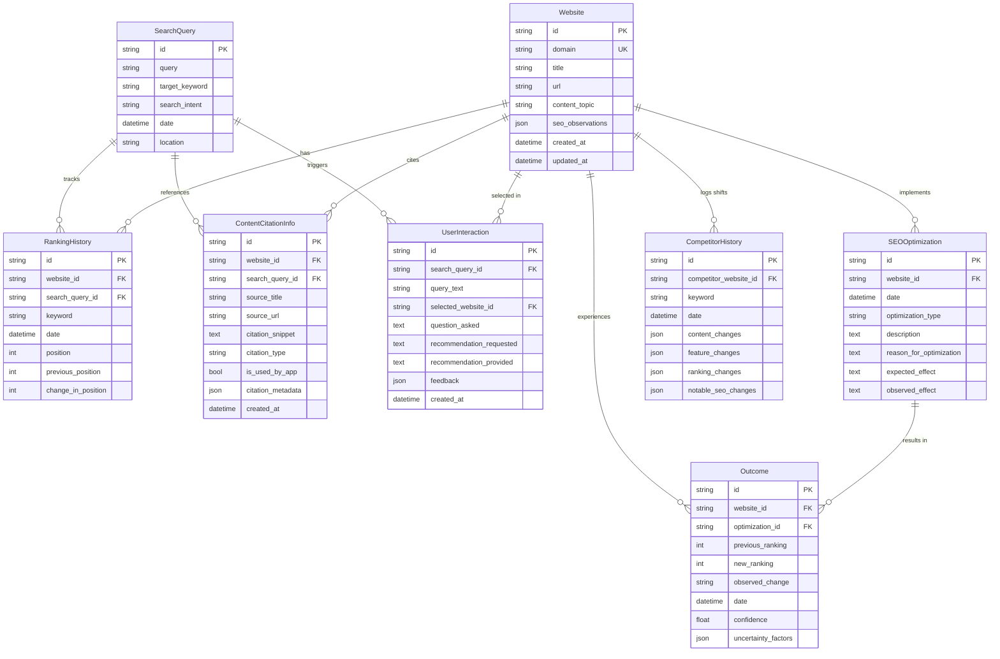

# RankMind Data Model Specification
## Schema, Relationships, Validation, and Hindsight Compatibility

---

### Executive Overview

RankMind's data architecture is specifically designed to store empirical SEO history and facilitate causal learning over time. Unlike generic tools that overwrite past observations with current state, RankMind preserves immutable historical milestones across 8 core entities:

1. **`SearchQuery`**: Search queries, target keywords, intent, timestamp, location.
2. **`Website`**: Analyzed domains, titles, URLs, topics, and structured SEO observation snapshots.
3. **`RankingHistory`**: Time-series ranking entries with before/after positions and net delta tracking.
4. **`SEOOptimization`**: Intentional optimizations deployed by the team (type, description, reason, hypothesis, and observed outcome).
5. **`CompetitorHistory`**: Structured record of competitor shifts (content diffs, feature changes, ranking deltas, notable SEO updates).
6. **`Outcome`**: Causal attribution records linking a specific optimization to ranking shifts with confidence scores and confounding factors.
7. **`ContentCitationInfo`**: Flexible citation and reference model for authoritative sources, benchmarks, and competitor citations.
8. **`UserInteraction`**: Query, selected website, questions asked, recommendations requested/provided, and user feedback.

---

### 1. Entity-Relationship Diagram (ERD)

---

### 2. Entity Definitions & Validation Rules

#### 1. `SearchQuery`
* **Purpose**: Tracks queries entered into the system.
* **Fields**:
  * `id` (`TEXT`, PK): Unique identifier (`sq_...`).
  * `query` (`TEXT`, Not Null): Query string (2–500 chars).
  * `target_keyword` (`TEXT`, Not Null): Normalized target keyword.
  * `search_intent` (`TEXT`, Enum): `informational`, `commercial`, `transactional`, `navigational`.
  * `date` (`TEXT` ISO 8601): Timestamp when query was captured.
  * `location` (`TEXT`, Nullable): Geolocation (e.g. `United States`, `Global`).

#### 2. `Website`
* **Purpose**: Represents a target or competitor page in the search ecosystem.
* **Fields**:
  * `id` (`TEXT`, PK): Unique identifier (`site_...`).
  * `domain` (`TEXT`, Unique, Indexed): Canonical domain (e.g. `learnpythonhub.io`).
  * `title` (`TEXT`, Not Null): HTML title tag.
  * `url` (`TEXT`, Not Null): Full target URL.
  * `content_topic` (`TEXT`, Default: `General`): Broad content cluster.
  * `seo_observations` (`JSON`, Not Null): Structured point-in-time signals (word count, interactive widget flags, video previews, schema types, readability score).
  * `created_at` / `updated_at` (`TEXT` ISO 8601).

#### 3. `RankingHistory`
* **Purpose**: Point-in-time ranking observations across evaluation milestones.
* **Fields**:
  * `id` (`TEXT`, PK): `rh_...`.
  * `website_id` (`TEXT`, FK -> `websites.id`, Cascade Delete).
  * `search_query_id` (`TEXT`, FK -> `search_queries.id`, Nullable).
  * `keyword` (`TEXT`, Indexed): Query keyword.
  * `date` (`TEXT` ISO 8601): Snapshot evaluation date.
  * `position` (`INTEGER`, Check: `position >= 1`): Rank (1 to 100).
  * `previous_position` (`INTEGER`, Nullable): Prior cycle rank.
  * `change_in_position` (`INTEGER`): Computed delta ($\Delta R = R_{prev} - R_{curr}$; e.g. `#8` to `#3` is `+5`).

#### 4. `SEOOptimization`
* **Purpose**: Records intentional SEO changes deployed by the growth team.
* **Fields**:
  * `id` (`TEXT`, PK): `opt_...`.
  * `website_id` (`TEXT`, FK -> `websites.id`, Cascade Delete).
  * `date` (`TEXT` ISO 8601): Date when the change was deployed.
  * `optimization_type` (`TEXT`, Enum):
    * `content_depth`, `interactive_ux`, `schema_markup`, `onpage_structure`, `freshness_update`, `credibility_certification`, `multimedia_expansion`, `technical_speed`.
  * `description` (`TEXT`, Not Null): Specific modifications deployed.
  * `reason_for_optimization` (`TEXT`, Not Null): Strategic rationale.
  * `expected_effect` (`TEXT`, Not Null): Expected hypothesis / impact.
  * `observed_effect` (`TEXT`, Nullable): Actual outcome observed post-evaluation.

#### 5. `CompetitorHistory`
* **Purpose**: Tracks competitor modifications between evaluation cycles.
* **Fields**:
  * `id` (`TEXT`, PK): `comp_hist_...`.
  * `competitor_website_id` (`TEXT`, FK -> `websites.id`, Cascade Delete).
  * `keyword` (`TEXT`, Indexed): Target keyword.
  * `date` (`TEXT` ISO 8601): Observation date.
  * `content_changes` (`JSON` List): Specific additions or cuts.
  * `feature_changes` (`JSON` List): Interactive, video, or UX additions.
  * `ranking_changes` (`JSON` Dict): `{ "before": 2, "after": 1, "delta": +1 }`.
  * `notable_seo_changes` (`JSON` List): Schema additions, canonical changes, etc.

#### 6. `Outcome`
* **Purpose**: Causal attribution link connecting an optimization to rank movements.
* **Fields**:
  * `id` (`TEXT`, PK): `out_...`.
  * `website_id` (`TEXT`, FK -> `websites.id`, Cascade Delete).
  * `optimization_id` (`TEXT`, FK -> `seo_optimizations.id`, Cascade Delete).
  * `previous_ranking` (`INTEGER`, Check: `>= 1`): Pre-action rank.
  * `new_ranking` (`INTEGER`, Check: `>= 1`): Post-action rank.
  * `observed_change` (`TEXT`): Human-readable delta (e.g. `+5 positions (#8 to #3)`).
  * `date` (`TEXT` ISO 8601): Evaluation timestamp.
  * `confidence` (`REAL`, Check: `0.0 <= confidence <= 1.0`): Statistical confidence score.
  * `uncertainty_factors` (`JSON` List): Confounding variables (e.g. algorithm volatility, competitor counter-moves).

#### 7. `ContentCitationInfo`
* **Purpose**: Flexible storage for citations, authoritative references, and industry benchmarks.
* **Fields**:
  * `id` (`TEXT`, PK): `cit_...`.
  * `website_id` (`TEXT`, FK -> `websites.id`, Nullable).
  * `search_query_id` (`TEXT`, FK -> `search_queries.id`, Nullable).
  * `source_title` (`TEXT`, Not Null): Citation title.
  * `source_url` (`TEXT`, Not Null): Source URL.
  * `citation_snippet` (`TEXT`, Nullable): Extracted reference text.
  * `citation_type` (`TEXT`, Enum): `authoritative_reference`, `dataset_source`, `competitor_reference`, `industry_study`.
  * `is_used_by_app` (`INTEGER`, Boolean: 1 or 0): Flag so only active citations are queried.
  * `citation_metadata` (`JSON` Dict): Arbitrary extensible key-value store for future citation workflows.

#### 8. `UserInteraction`
* **Purpose**: Records questions asked, recommendations requested, and user feedback.
* **Fields**:
  * `id` (`TEXT`, PK): `ui_...`.
  * `search_query_id` (`TEXT`, FK -> `search_queries.id`, Nullable).
  * `query_text` (`TEXT`, Not Null): Input query.
  * `selected_website_id` (`TEXT`, FK -> `websites.id`, Nullable).
  * `question_asked` (`TEXT`, Nullable): User's diagnostic question.
  * `recommendation_requested` (`TEXT`, Nullable): Scope of requested recommendation.
  * `recommendation_provided` (`TEXT`, Nullable): Agent's generated recommendation.
  * `feedback` (`JSON` Dict): Rating (1-5), boolean helpfulness, and qualitative notes.
  * `created_at` (`TEXT` ISO 8601).

---

### 3. Hindsight Memory Storage Compatibility

The schema directly maps to future Hindsight memory ingestion:

| Hindsight Layer | Database Entity Mapping | Purpose in Memory Retrieval |
|---|---|---|
| **SERP History** | `SearchQuery` + `RankingHistory` | Reconstructs complete SERP leaderboard at any historical date $T$. |
| **Competitor Diffs** | `CompetitorHistory` | Recalls competitor moves that coincided with rank changes. |
| **Action Ledger** | `SEOOptimization` | Retrieves past experiments, hypotheses, and scope. |
| **Causal Heuristics** | `Outcome` | Distills empirical rules: *"For query Q, action type A produced delta Δ with confidence C"*. |
| **Knowledge Base** | `ContentCitationInfo` | Provides cited authority evidence for recommendations. |
| **Interaction Memory**| `UserInteraction` | Remembers previous questions and user preferences. |

---

### 4. REST API CRUD Endpoints Summary

All 8 entities are accessible via REST API (`/api/v1/entities/...`):

| Entity | Create | Read / List | Update |
|---|---|---|---|
| **Search Queries** | `POST /entities/search-queries` | `GET /entities/search-queries`, `GET /entities/search-queries/{id}` | `PATCH /entities/search-queries/{id}` |
| **Websites** | `POST /entities/websites` | `GET /entities/websites`, `GET /entities/websites/{id}` | `PATCH /entities/websites/{id}` |
| **Ranking History**| `POST /entities/ranking-history`| `GET /entities/ranking-history?website_id=...` | — |
| **SEO Optimizations**| `POST /entities/seo-optimizations`| `GET /entities/seo-optimizations?website_id=...` | `PATCH /entities/seo-optimizations/{id}` |
| **Competitor History**| `POST /entities/competitor-history`| `GET /entities/competitor-history` | — |
| **Outcomes** | `POST /entities/outcomes` | `GET /entities/outcomes`, `GET /entities/outcomes/{id}` | `PATCH /entities/outcomes/{id}` |
| **Citations** | `POST /entities/citations` | `GET /entities/citations`, `GET /entities/citations/{id}` | `PATCH /entities/citations/{id}` |
| **User Interactions**| `POST /entities/user-interactions`| `GET /entities/user-interactions`, `GET /entities/user-interactions/{id}`| `PATCH /entities/user-interactions/{id}` |
