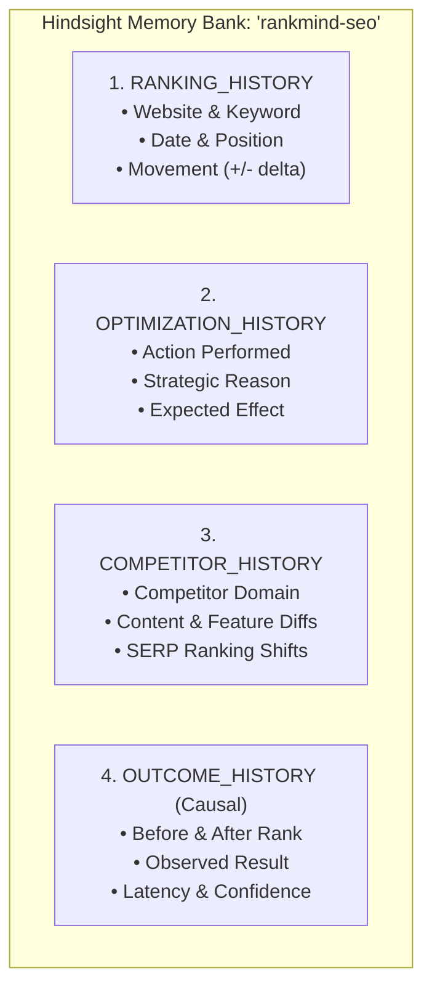

# RankMind: Hindsight Persistent Memory Integration

## 1. Executive Summary & Vision

In typical SEO tools and naive AI search assistants, recommendations are stateless: every time a user requests advice, an analyzer or LLM inspects only the page's current snapshot and produces generic recommendations (e.g. *"add 1,500 words of content"*, *"add more FAQ accordions"*).

**In RankMind, Hindsight (`vectorize-io/hindsight`) is the CENTRAL memory layer**, not an optional peripheral or simple SQL cache. The agent retains institutional knowledge across 4 critical historical categories:
1. **RANKING HISTORY** (website, keyword, date, ranking, ranking movement)
2. **OPTIMIZATION HISTORY** (optimization performed, date, website, reason, context)
3. **COMPETITOR HISTORY** (competitor changes, date, observed ranking changes, competitive events)
4. **OUTCOME HISTORY** (optimization, previous ranking, later ranking, observed result, time period, uncertainty)

When a new query is submitted, the agent **recalls** only relevant historical memories, synthesizes them alongside current on-page observations, explicitly **suppresses disproven tactics**, addresses **competitor counter-moves**, and produces **context-aware recommendations**.

---

## 2. The 4 Hindsight Memory Categories

Each event retained in Hindsight belongs to one of four structured memory categories:



| Category | Stored Attributes | Operational Role in Reasoning |
| :--- | :--- | :--- |
| **`RANKING_HISTORY`** | `website`, `keyword`, `date`, `ranking`, `ranking_movement` | Establishes the empirical trajectory and momentum of the target domain. |
| **`OPTIMIZATION_HISTORY`** | `optimization_type`, `description`, `reason`, `expected_effect`, `date`, `website` | Tracks what strategic bets the site deployed and why. |
| **`COMPETITOR_HISTORY`** | `competitor`, `date`, `content_changes`, `feature_changes`, `notable_seo_changes`, `ranking_changes` | Alerts the agent when rivals deploy counter-measures (e.g., video previews, schemas). |
| **`OUTCOME_HISTORY`** | `optimization`, `previous_ranking`, `later_ranking`, `observed_result`, `time_period`, `confidence`, `uncertainty` | The gold-standard causal ground truth; proves which optimizations drove improvements and which failed. |

---

## 3. The Continuous Memory Flow

```
NEW INFORMATION / FACT
       │
       ▼
[RETAIN IN HINDSIGHT] ──> Tagged by category, keyword, domain, metadata & audit logged
       │
NEW SEO QUERY
       │
       ▼
[RECALL RELEVANT MEMORY] ──> Category-stratified bounded retrieval with relevance scores & 'why_relevant'
       │
CURRENT SEO SIGNALS + RECALLED MEMORIES
       │
       ▼
[LLM REASONING AGENT] ──> Suppresses failed tactics; cites historical outcomes & competitor actions
       │
       ▼
[CONTEXT-AWARE RECOMMENDATIONS]
       │
AFTER OPTIMIZATION / OUTCOME EVENT
       │
       ▼
[RETAIN NEW RESULT] ──> Memory bank is updated; future queries benefit from the new learning
```

---

## 4. Official SDK and Dual-Engine Architecture

RankMind adheres strictly to the official `hindsight-client` Python SDK syntax:
- **`retain(bank_id, content, metadata, tags, timestamp)`**
- **`recall(bank_id, query, tags, budget, max_tokens)`**

### Dual-Engine Resilience:
1. **Remote Cloud / Server Mode**: When an active Hindsight daemon or vectorize.io cluster is reachable at `HINDSIGHT_API_URL`, the client uses the official `hindsight_client.Hindsight` SDK directly.
2. **Local Standalone Engine**: Built directly into SQLite tables (`hindsight_memories`, `hindsight_retain_logs`, `hindsight_recall_logs`) with fast indexed keyword matching, category-stratified priority ranking, and zero third-party binary dependencies.

---

## 5. Developer Audit Logging: What, What, and Why

The platform provides complete observability so developers can inspect every retention and recall action:

- **What was retained**:
  - `id`: Unique memory ID (`mem_out_...`, `mem_ran_...`)
  - `category`: The designated memory category
  - `target_keyword` & `target_domain`
  - `content_snippet`: Verifiable event text
  - `tags`: Indexed tags (`["outcome", "causal", "structured_schema", "python"]`)
- **What was recalled**:
  - `id`: Audit log ID
  - `query`: The incoming query triggering retrieval
  - `recalled_count`: Number of memories retrieved under token budget
  - `recalled_memory_ids`: List of exact memory IDs injected into the LLM
- **Why it was relevant**:
  - `why_relevant`: Explicit attribution string explaining the scoring breakdown:
    - *"Exact target keyword match"*
    - *"Direct history for target domain 'learnpythonhub.io'"*
    - *"Competitor intelligence in same query SERP ('coursera.org')"*
    - *"Empirical causal outcome record"*

Audit logs can be queried via `GET /api/v1/hindsight/logs` or inspected interactively in the Developer Studio at `/hindsight`.

---

## 6. Empirical Demonstration: Baseline vs Hindsight Contrast

The core requirement of this architecture is demonstrating that the **same query produces a vastly superior, context-aware strategy when historical memory exists**.

### Query: `"best python courses for beginners"` | Target: `learnpythonhub.io`

| Evaluation Dimension | Stateless Baseline Analyzer (No Memory) | RankMind with Hindsight Memory |
| :--- | :--- | :--- |
| **Word Count / Content Depth** | Observes competitors have 4,000+ words; recommends **"Expand content depth and add 1,500 words of passive text"**. | **EXPLICITLY SUPPRESSED**: Recalls that in Cycle 1, adding 1,600 words of text yielded **zero ranking delta** (#8 → #8, 21-day latency). |
| **Interactive Coding Sandbox** | Treats the sandbox as an isolated UX attribute with no historical context. | **CONFIRMED HIGH-LEVERAGE**: Recalls that embedding the interactive code sandbox previously drove a **+5 position surge** (#8 → #3). |
| **Competitor Understanding** | Unaware of competitor timeline or recent ranking trajectory. | **RECALLS COMPETITOR COUNTER-MOVE**: Recalls that Coursera and freeCodeCamp deployed Video Previews and Course Schemas, causing `learnpythonhub.io` to slip from #3 to #4. |
| **Actionable Strategy** | Generic text expansion and standard FAQ markup. | **TARGETED COUNTER-MEASURES**: Prescribes Course/Credential Schema and 90-second video project walkthroughs to neutralize competitor SERP visual dominance and reclaim top 3. |

---

## 7. Interactive Developer Studio

Developers and stakeholders can test and inspect the memory layer through the interactive web dashboard at:
```
http://localhost:8000/hindsight
```

### Studio Tabs:
1. **⚖️ Baseline vs Hindsight Contrast**: Live side-by-side comparison demonstrating the strategic difference.
2. **🔍 Query Recall Inspector**: Interactive tool to test how query keywords match and score against the memory bank.
3. **🧠 Memory Bank Explorer**: Search and filter all memories by category (`RANKING_HISTORY`, `OPTIMIZATION_HISTORY`, `COMPETITOR_HISTORY`, `OUTCOME_HISTORY`).
4. **📋 Developer Audit Logs**: Real-time stream of retention and recall events with relevance summaries.
5. **➕ Retain New Event Studio**: Web form allowing engineers to manually inject new optimization or causal outcome events into the memory bank.

---

## 8. API Reference Summary

| Method | Endpoint | Description |
| :--- | :--- | :--- |
| `POST` | `/api/v1/hindsight/retain` | Retains a new memory fact under one of the 4 core categories. |
| `GET` | `/api/v1/hindsight/recall` | Recalls relevant historical memories with scores and `why_relevant` reasons. |
| `POST` | `/api/v1/hindsight/analyze` | Executes memory-augmented SEO reasoning and returns context-aware recommendations. |
| `GET` | `/api/v1/hindsight/compare` | Runs side-by-side comparison between Baseline and Hindsight for any query. |
| `GET` | `/api/v1/hindsight/logs` | Developer audit logs for retention and recall events. |
| `GET` | `/api/v1/hindsight/memories` | Browse memory items filtered by category. |
| `POST` | `/api/v1/hindsight/sync` | Populates Hindsight memory bank from existing historical database records. |
| `GET` | `/hindsight` | Interactive Developer Testing Studio HTML interface. |
