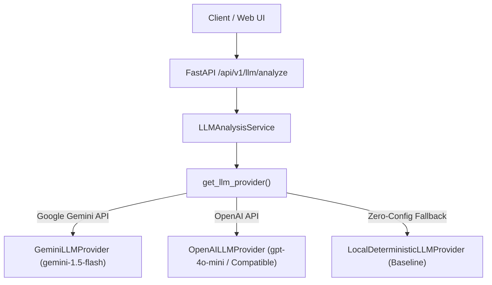

# RankMind LLM SEO Reasoning Integration
## Architecture, Truth Discipline, Modular Providers, and 3-Layer Response Schema

---

### Executive Overview

The **RankMind LLM Reasoning Agent** integrates large language models into the search intelligence pipeline. It ingests verified factual outputs from the deterministic SEO analyzer and performs structured diagnostic reasoning.

Crucially, this phase adheres to **strict truth discipline**:
* **No Hindsight Memory Yet**: The model is explicitly isolated from historical timeline memory (`hindsight_memory_applied = False`).
* **Zero Hallucination of Historical Metrics**: The model is forbidden from inventing past rank changes (e.g. *"Last month your rank dropped by 3 positions"*).
* **3-Way Output Boundary**: The response explicitly isolates **Observed Data** from **AI Interpretation** from **Recommendations**.
* **Evidence Gaps as Explicit Questions**: When data is incomplete (e.g. missing dwell time, mobile Core Web Vitals, or backlink velocity), the model explicitly identifies missing evidence and formulates clarifying questions instead of guessing.

---

### 1. The 3-Layer Response Schema

To ensure complete clarity and machine-readability, the LLM response is strictly partitioned into three distinct layers:

```
┌────────────────────────────────────────────────────────┐
│ LAYER 1: VERIFIED OBSERVED DATA                        │
│ Factual grounding extracted directly by analyzer:      │
│ • Detected Search Intent & Match Score                 │
│ • Exact Title, Meta, H1/H2 Counts                      │
│ • Word Count vs Intent Benchmark                       │
│ • Interactive Tools, Video Previews, Tables            │
│ • Schema Types Present vs Missing Schemas              │
│ • Known Competitor Current Observations                │
├────────────────────────────────────────────────────────┤
│ LAYER 2: AI INTERPRETATION & DIAGNOSIS                 │
│ Heuristic reasoning (clearly marked as AI opinion):    │
│ • High-Level SEO Performance Diagnosis                 │
│ • Search Intent Fit Assessment                         │
│ • Main Weaknesses with Severity & Evidence             │
│ • Evidence Sufficiency Rating (Sufficient / Moderate)  │
│ • Missing Evidence & Clarifying Questions              │
├────────────────────────────────────────────────────────┤
│ LAYER 3: PRESCRIPTIVE RECOMMENDATIONS                  │
│ Forward-looking optimizations:                         │
│ • Prioritized Actions (Priority 1 to 4)                │
│ • Detailed Heuristic Rationale                         │
│ • Expected Direction of Improvement (No Fake Deltas)   │
│ • Step-by-Step Implementation Checklist                │
└────────────────────────────────────────────────────────┘
```

---

### 2. Modular LLM Provider Architecture

RankMind uses an abstract provider interface (`BaseLLMProvider`) allowing seamless hot-swapping between different model backends:



#### Provider Implementations:
1. **`GeminiLLMProvider`**:
   * Uses standard `httpx.AsyncClient` with `gemini-1.5-flash` or `gemini-2.0-flash`.
   * Enforces structured JSON output via `responseMimeType: "application/json"`.
   * Built-in exponential backoff retries (up to 3 attempts on rate-limits 429 or 5xx).
2. **`OpenAILLMProvider`**:
   * Supports OpenAI, Groq, Ollama, DeepSeek, or any OpenAI-compatible completions endpoint.
   * Uses `response_format: {"type": "json_object"}`.
3. **`LocalDeterministicLLMProvider`**:
   * High-fidelity zero-network fallback engine.
   * Ensures the test suite and local developers can run immediately without paid API keys, while validating exact schema conformity.

---

### 3. API-Key Protection & Security

* **No Hardcoded Keys**: API keys are never stored in source code.
* **Resolution Hierarchy**:
  1. Per-request header: `X-API-Key: ...`
  2. Per-request body: `api_key: ...` (masked from API response)
  3. Environment variables: `GEMINI_API_KEY` or `OPENAI_API_KEY`
  4. Graceful Fallback: If no key is detected, the system automatically uses the Local Deterministic Provider with a clear label: `provider_used: "local-deterministic-engine"`.

---

### 4. Interactive Testing Interface

Navigate to **`http://127.0.0.1:8000/llm-analysis`** in your browser:

* **Preset Scenarios**: Instant one-click testing of Python Courses (`learnpythonhub.io`), Competitor Leader (`coursera.org`), or FastAPI vs Express (`benchmarks-dev.io`).
* **Live Provider Selector**: Switch between Auto-Detect, Local Engine, Google Gemini, and OpenAI.
* **Visual Layer Panels**:
  * 📊 **Layer 1: Verified Observed Data** (metrics, feature badges, competitor comparison)
  * 🧠 **Layer 2: AI Interpretation** (diagnosis, intent fit, weaknesses with severity badges, and missing evidence questions box)
  * 🎯 **Layer 3: Recommendations** (priority cards, heuristic rationale, expected direction of improvement, implementation steps)
* **Raw Prompt & JSON Inspector**: Toggleable view showing the exact prompt sent and JSON returned.

---

### 5. REST API Specification

#### Endpoint: `POST /api/v1/llm/analyze`

**Request Payload**:
```json
{
  "query": "best python courses for beginners",
  "website_id": "site_learnpythonhub",
  "provider": "auto",
  "api_key": null
}
```

**Response Payload**:
```json
{
  "analysis_id": "llm_ana_a7428f910b",
  "timestamp": "2026-09-27T18:00:00Z",
  "provider_used": "local-deterministic-engine (Baseline)",
  "query": "best python courses for beginners",
  "target_domain": "learnpythonhub.io",
  "hindsight_memory_applied": false,
  
  "observed_data": {
    "target_query": "best python courses for beginners",
    "target_domain": "learnpythonhub.io",
    "search_intent_detected": "commercial",
    "intent_match_score": 85.0,
    "word_count": 3650,
    "has_interactive_widget": true,
    "has_video_preview": false,
    "schema_types_present": ["Article", "ItemList"],
    "missing_schemas_detected": ["Course", "EducationalOccupationalCredential"]
  },
  
  "ai_interpretation": {
    "seo_diagnosis": "The target page demonstrates strong foundational content and tactile user engagement...",
    "intent_fit_assessment": "Moderate-to-High. The query is commercial-investigational...",
    "main_weaknesses": [
      {
        "weakness": "Absence of Course and EducationalCredential Schema Markup",
        "category": "technical",
        "severity": "high",
        "evidence": "Observed schema_types_present only include ['Article', 'ItemList']."
      }
    ],
    "evidence_sufficiency_rating": "Moderate",
    "missing_evidence_or_questions": [
      "What is the actual user bounce rate and average session duration on the interactive sandbox widget?",
      "Does the page receive organic backlinks from accredited universities?"
    ],
    "disclaimer": "AI interpretation derived purely from isolated on-page signals. No historical ranking timeline or causal memory was consulted."
  },
  
  "recommendations": [
    {
      "id": "rec_01",
      "priority": 1,
      "title": "Implement Course & EducationalOccupationalCredential Schema",
      "category": "technical",
      "reasoning": "Google's structured data guidelines require 'Course' schema to qualify for course carousels...",
      "expected_direction_of_improvement": "Expected to unlock eligibility for Google Course Rich Carousel and improve CTR.",
      "implementation_steps": [
        "Inject JSON-LD script into <head> with @type: 'Course' and 'ItemList'.",
        "Specify provider name, course duration, and certificate status."
      ]
    }
  ]
}
```
