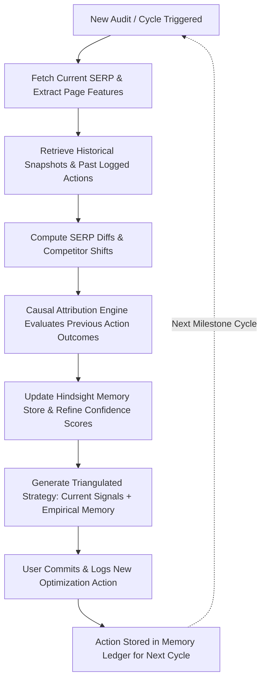

# RankMind: AI-Powered SEO & Search Intelligence Agent
## Product Specification (v1.0 - Foundation & MVP)

---

### Executive Summary
Most SEO tools provide static audits (broken links, generic keyword density, standard metadata checklists) or generic LLM advice that repeats the same basic advice regardless of what actually works. 

**RankMind** is an empirical SEO intelligence agent engineered around **persistent historical memory ("Hindsight Memory")**. Instead of treating every SERP audit in isolation, RankMind remembers:
1. Past ranking trajectories.
2. Exact optimization actions taken by the team.
3. Competitor content and structural moves.
4. Which specific actions correlated with ranking improvements versus those that had zero or negative impact.

Over time, RankMind transitions from theoretical SEO advice to **empirically proven strategies specific to each target query and SERP ecosystem**.

---

### 1. User Persona
- **Persona**: **Alex Vance** — Head of SEO & Organic Growth
- **Organization**: Mid-market SaaS / High-authority content platform / Digital Agency managing performance-critical accounts.
- **Profile & Context**:
  - Manages 10–50 high-value target keywords that drive high revenue/conversions.
  - Constantly tests content updates, schema tweaks, structural overhauls, and UX features.
  - Frustrated by standard SEO software because it only displays current status without institutional memory of *why* ranks changed or *what actions caused the shift*.
  - When team members turn over, previous SEO experiments and learnings are lost in old spreadsheets.
- **Alex's Core Job to Be Done**:
  > *"When my target page drops from #2 to #5 for a primary keyword, I need an intelligence agent that reviews our historical changes, analyzes what our competitors just changed, checks what worked for us in the past, and recommends the highest-probability countermeasure backed by historical evidence."*

---

### 2. Primary User Workflow
RankMind focuses on **one singular, high-leverage primary workflow**:

#### **"The Empirical SERP Audit & Outcome Attribution Loop"**
```
1. Input Target Keyword & Domain (e.g., "best python courses for beginners", learnpythonhub.io)
                                  │
                                  ▼
2. SERP Snapshot Extraction (Top 10 leaderboard, content depth, interactive tools, schema, intent)
                                  │
                                  ▼
3. Hindsight Memory Recall (Fetch historical snapshots, previous action logs, competitor diffs)
                                  │
                                  ▼
4. Triangulated Intelligence Synthesis (Current SERP Reality + Historical Evidence + Competitor Diffs)
                                  │
                                  ▼
5. Four-Tier Intelligence Output:
   [Current Observations]  -> What the SERP looks like right now
   [Historical Memory]     -> Past actions taken & observed rank changes over time
   [Attribution Insights]  -> Why previous actions succeeded or failed
   [Prescriptive Actions]  -> Recommended next steps weighted by past empirical success
                                  │
                                  ▼
6. Optimization Action Logging (Alex selects/logs an action to be tracked in the next cycle)
```

---

### 3. MVP Scope
To maintain an uncompromising focus on quality, the MVP targets one core value proposition:

#### **Core Value Proposition**
> *"The only search intelligence system that learns what actually moves the needle for your specific search queries by remembering past optimizations and competitor shifts."*

#### **In-Scope for MVP**:
1. **Target Keyword Command Center**:
   - Query profiling (`"best python courses for beginners"` as flagship seed scenario).
   - Multi-snapshot timeline showing rank changes across cycles (e.g., Day 0, Day 30, Day 60, Day 90).
2. **SERP Analyzer & Feature Extractor**:
   - Top 10 SERP ranking records.
   - Key ranking features extracted: Content depth, Code/Interactive features, Certification signals, Freshness/Publish dates, Schema markup, Intent alignment.
3. **Hindsight Memory Engine**:
   - Persistent store for SERP snapshots, competitor structural diffs, user optimization logs, and attribution links.
   - Memory nodes that explicitly store: *"Action X executed on Date Y resulted in Rank Change ΔZ after N days with Confidence Score C"*.
4. **Attribution & Recommendation Engine**:
   - Distinguishes between **Current Observations**, **Historical Memory**, **Recommendations**, and **Observed Outcomes**.
   - Tags recommendations with evidence tier: `[Historically Proven]`, `[Competitor Trend]`, or `[Theoretical Hypothesis]`.
5. **Action Logger**:
   - Allows the user to record an applied change (e.g., "Added interactive code runner & updated curriculum comparison").
   - Ties logged actions directly into future evaluation snapshots to close the learning loop.

#### **Explicitly Out-of-Scope for MVP**:
- Automated CMS publishing / auto-editing user sites directly.
- Full-web crawling spiders (focused on top-10/20 SERP results per target query).
- Complex enterprise team RBAC / multi-tenant billing tiers.

---

### 4. Core Screens

#### **Screen 1: Query Intelligence & SERP Leaderboard**
- **Header**: Target Keyword, Target Domain, Current Rank, Historical Peak, 30-Day Velocity, Memory Confidence Level.
- **Live SERP Matrix**: Table comparing Top 10 URLs with feature badges (Word Count, Interactive Demos, Video Previews, Schema types, Updated Date).
- **Signal Breakdown**: Visual indicators showing where the target domain leads or lags behind top 3 competitors.

#### **Screen 2: Historical Hindsight Timeline & Trajectory**
- **Trajectory Chart**: Interactive time-series showing rank curves for Target Domain vs. Top 3 Competitors over evaluation milestones.
- **Event Pin Markers**: Visual badges on the timeline marking:
  - 🛠️ *Optimization Logged* (e.g., "Added interactive code sandbox")
  - ⚡ *Competitor Move Detected* (e.g., "Codecademy launched free certificate preview")
  - 📈 *Algorithm / SERP Re-alignment*

#### **Screen 3: Causal Attribution Ledger ("What Worked vs. What Failed")**
- **Memory Ledger Table**:
  - **Date**: Evaluation window.
  - **Action Logged**: Exact description of past change.
  - **Pre vs. Post Rank**: (e.g., `#7 → #3`).
  - **Observed Outcome**: Empirical delta with time latency.
  - **Attribution Verdict**: Effective / Ineffective / Confounded by competitor surge.
  - **Memory Lesson**: Agent's distilled takeaway retained for future audits.

#### **Screen 4: Strategic Recommendations & Action Commit Studio**
- **Segmented Intelligence Panel**:
  1. **Current Observations**: Factual breakdown of current #1-#3 ranking advantages.
  2. **Historical Memory & Lessons**: What past iterations in this exact keyword space taught the agent.
  3. **Prescriptive Recommendations**: Concrete, prioritized recommendations with rationale and historical proof tags.
  4. **Action Commit Drawer**: Instant form to log the planned optimization to evaluate in the next snapshot.

---

### 5. Information The System Needs

| Domain | Data Entities | Key Fields |
|---|---|---|
| **SERP Data** | Query Snapshot | Query string, Timestamp, Search location/device, Total results, Top 10-20 items |
| **Ranked Page Data** | Page Attributes | URL, Domain, Rank, Title, Meta Description, H1/H2 tags, Content length, Schema types, Has interactive widgets, Has video, Last updated date |
| **Competitor Diffs** | Delta Records | Pre-snapshot hash vs Post-snapshot hash, Added sections, Deleted sections, Schema modifications, UX additions |
| **User Action Logs** | Optimization Entries | Action ID, Target URL, Timestamp, Category (Content, UX, Schema, Authority), Action Description, Expected Hypothesis |
| **Attribution Data** | Causal Records | Action ID, Snapshot Before ID, Snapshot After ID, Pre-Rank, Post-Rank, Rank Delta, Evaluation Latency (days), Attribution Confidence, Confounding Factors |

---

### 6. What Hindsight Memory Will Remember

Hindsight Memory is structured into **four persistent memory layers**:

1. **SERP State Memory (`serp_history`)**:
   - Exact rank positions of all competitors over time.
   - Historical shifts in SERP composition (e.g., Did Google start favoring video snippets or interactive sandboxes for this query?).

2. **Competitor Evolution Memory (`competitor_history`)**:
   - Timeline of competitor feature additions, title rewrites, content expansions, and schema adjustments.

3. **Optimization Experiment Memory (`action_ledger`)**:
   - Complete record of internal optimizations executed by the team, including hypothesis, scope, and implementation date.

4. **Causal Attribution & Lesson Memory (`learned_heuristics`)**:
   - High-signal heuristics distilled from repeated observations:
     - *Example Heuristic*: "For `best python courses`, adding hands-on coding exercises yields a +3 to +5 rank delta within 21 days; expanding passive text length without interactive elements produces 0 rank movement."
     - *Example Heuristic*: "When Competitor X updates pricing tables, they typically experience a temporary +1 boost followed by re-stabilization."

---

### 7. The Learning Loop



1. **Cycle Genesis**: A snapshot is captured at $T_0$. Initial baseline established.
2. **Action Execution**: The team logs an action (e.g., adding an interactive curriculum preview).
3. **Time Latency & Re-Evaluation**: At $T_1$ (e.g., +21 days), the next snapshot is gathered.
4. **Attribution Analysis**: The system measures ranking delta ($\Delta R$), checks if competitors also modified their pages, and evaluates correlation.
5. **Memory Fortification**: The system writes a permanent record into the Hindsight Memory Ledger. If an action worked, its heuristic weight increases; if it failed, future generic recommendations for that tactic are suppressed.
6. **Adaptive Intelligence**: In subsequent audits, the agent references its own recorded experience rather than default guidelines.
