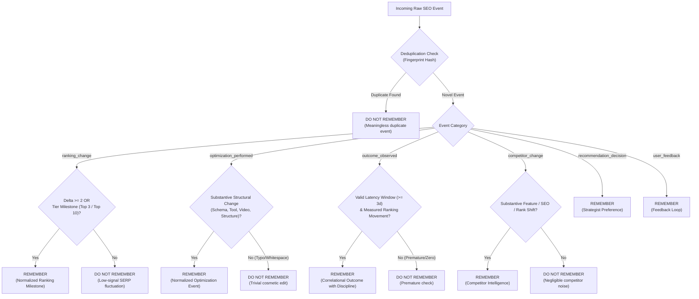

# RankMind: Intelligent RETAIN Workflow & Memory-Quality Layer

## 1. Overview & Problem Definition

In naive AI applications, systems commit every piece of raw incoming data into persistent storage. For search intelligence, this causes catastrophic **memory pollution**:
- Daily SERP micro-fluctuations (e.g. moving between #14 and #15) dilute actual ranking signals.
- Trivial copyedits (fixing a comma or correcting a typo) create clutter without strategic value.
- Duplicate events flood the retrieval context, crowding out distinct historical milestones.
- Naive agents assert definitive causality (e.g., claiming a minor text edit *"definitely caused"* a ranking surge), violating scientific truth discipline.

To solve this, RankMind introduces an **Event-Processing & Memory-Quality Layer** that acts as an intelligent gatekeeper:
```
Raw SEO Event ──> [EVENT-PROCESSING & QUALITY LAYER] ──> REMEMBER (Retained into Hindsight)
                                                     └──> DO NOT REMEMBER (Suppressed & Logged)
```

---

## 2. Gatekeeper Decision Logic: REMEMBER vs DO NOT REMEMBER

Every incoming event is evaluated against objective significance criteria and deduplication checks:



---

## 3. Deduplication Engine (Avoiding Duplicate Memories)

To prevent storing redundant memories, the layer generates a deterministic cryptographic fingerprint:
```
fingerprint = sha256(f"{website}:{keyword}:{event_type}:{normalized_action_or_delta}")[:16]
```
If an identical event has already been retained in `hindsight_retention_decisions` with decision `REMEMBER`, the event-processing layer immediately flags it:
- **Decision**: `DO NOT REMEMBER`
- **Reason**: `Meaningless duplicate event: identical optimization_performed for 'testrankhub.com' on 'react state management' has already been retained into memory (fingerprint: 4b155d42dd2e33e8).`
- **Importance Score**: `0.0`
- **Audit Action**: Logged in the developer decision audit table.

---

## 4. Normalized Memory Representation

Every accepted event (`REMEMBER`) is transformed into a rich, structured context containing 8 normalized fields:

| Field | Type | Description | Example |
| :--- | :--- | :--- | :--- |
| **`event`** | `str` | Normalized event identifier | `ranking_tier_transition`, `optimization_performed`, `outcome_observed` |
| **`website`** | `str` | Target website domain | `learnpythonhub.io` |
| **`keyword`** | `str` | Target query / target keyword | `best python courses for beginners` |
| **`date`** | `str` | ISO 8601 timestamp | `2026-09-27T10:00:00Z` |
| **`context`** | `str` | Rich background context & environment | `Post-optimization tracking window (21 days) for 'learnpythonhub.io' on keyword 'best python courses for beginners'.` |
| **`action`** | `str` | Specific optimization or competitor change | `[STRUCTURED_SCHEMA] Deployed Course and VideoObject JSON-LD schema` |
| **`result`** | `str` | Observed empirical movement (disciplined) | `After this change ('Deployed Course schema'), the observed ranking moved from #14 to #3 (+11 positions) over a 21-day latency window.` |
| **`confidence`** | `float` | Statistical confidence rating (0.0 to 1.0) | `0.88` |
| **`uncertainty_factors`** | `List[str]` | Observed confounders or SERP volatility | `["External search algorithm core update occurred during evaluation window"]` |
| **`language_discipline_note`** | `str` | Verification of non-hallucinatory language | `Correlational observation: 'After this change, the observed ranking moved from X to Y' - no definitive causality asserted.` |

---

## 5. Correlational Truth Discipline (Non-Hallucinatory Attribution)

Search engine algorithms evaluate hundreds of signals simultaneously alongside competitor updates and user query trends. Claiming that a specific optimization was the sole, definitive cause of a ranking improvement is intellectually dishonest and factually incorrect.

RankMind enforces **correlational truth discipline**:

> [!IMPORTANT]
> **Disciplined Language**:  
> *"After this change ('[Action]'), the observed ranking moved from #X to #Y (+Z positions) over a 21-day latency window."*  
> 
> **Prohibited Language**:  
> ~~*"This change definitely caused the ranking improvement."*~~  
> ~~*"Adding this schema caused Google to rank the site at #1."*~~

All outcome memories record explicit `confidence` levels and list possible `uncertainty_factors` (such as concurrent competitor updates or seasonal search shifts).

---

## 6. Developer Observability & Audit Logs

The platform provides complete developer visibility into every memory gatekeeper decision:

### 1. SQLite Table: `hindsight_retention_decisions`
- `id`: Decision ID (`dec_...`)
- `timestamp`: ISO timestamp
- `event_type`: Categorical event type
- `website`: Target domain
- `keyword`: Target keyword
- `decision`: `REMEMBER` or `DO NOT REMEMBER`
- `reason`: Explicit gatekeeper rationale
- `importance_score`: Computed importance (0.0 to 1.0)
- `fingerprint`: Deduplication hash
- `content_snippet`: Stored memory fact snippet (if accepted)
- `normalized_data`: Full JSON of `NormalizedMemoryRepresentation`

### 2. REST API Endpoints
- `POST /api/v1/hindsight/process-event`: Ingests `RawSEOEvent`, returns `RetentionDecisionResult`.
- `GET /api/v1/hindsight/decisions`: Returns decision audit logs with optional `decision=REMEMBER` filter.
- `GET /api/v1/hindsight/logs?log_type=decisions`: Integrated audit inspection.

### 3. Interactive Web Studio (`/hindsight`)
- **🛡️ Event-Quality Gatekeeper Tab**:
  - Live interactive Event Tester with 6 presets (`Significant Rank Surge`, `Top 3 Milestone`, `Micro-Fluctuation Noise`, `Important Optimization`, `Trivial Typo`, `Empirical Outcome`).
  - Real-time decision badge rendering (Green for `REMEMBER`, Red for `DO NOT REMEMBER`).
  - Live table of all recent memory-quality decisions.

---

## 7. Automated Test Suite Verification

The complete RETAIN workflow is covered in [`backend/tests/test_retain_workflow.py`](file:///c:/Users/sripa/OneDrive/Desktop/RankMind/backend/tests/test_retain_workflow.py):

| Test Case | Scenario | Expected Decision | Outcome |
| :--- | :--- | :--- | :--- |
| **Case 1** | Significant ranking shift (`delta = 6`, #9 to #3) | `REMEMBER` (Score >= 0.75) | ✅ **PASS** |
| **Case 2** | Important optimization (`structured_schema`) | `REMEMBER` (Score >= 0.80) | ✅ **PASS** |
| **Case 3** | Meaningless duplicate event (identical action & keyword) | `DO NOT REMEMBER` (Score 0.0) | ✅ **PASS** |
| **Case 4** | Empirical outcome (disciplined correlational language) | `REMEMBER` (Score >= 0.90) | ✅ **PASS** |
| **Case 5** | Micro-fluctuation noise (`delta = 1`, outside tiers) | `DO NOT REMEMBER` (SERP noise) | ✅ **PASS** |
| **Case 6** | Trivial cosmetic edit (`typo_fix` in footer) | `DO NOT REMEMBER` (Trivial edit) | ✅ **PASS** |
| **Case 7** | HTTP API Endpoints (`POST /process-event`, `GET /decisions`) | `HTTP 200` with decision JSON | ✅ **PASS** |

Run verification:
```powershell
python -m unittest discover tests
# Ran 33 tests in 3.494s - OK
```
